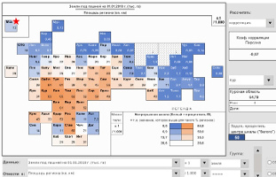
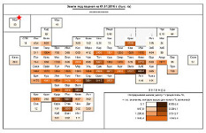

 <h2>Плиточный картоид России  Tile Grid Map of Russia </h2>  

 
  
Плиточный картоид России, Исходный пост ВКонтакте. &nbsp; <ins> <a href = "https://vk.com/politicalgeography?w=wall-145162562_690">Открыть</a></ins> 

Плиточный картоид России, автоматизация в MS Excel. &nbsp; <ins> <a href = "Tile%20Grid%20Maps%20of%20Russia%20-%20Excel%20-%201.2.zip">Скачать</a></ins> 

Плиточный Атлас земель по регионам России - 2017. &nbsp; <ins> <a href = "Tile%20Atlas%20of%20lands%20by%20regions%20of%20Russia%20-%202017.zip">Скачать</a></ins>  

 

Tile Grid Map of Russia, automated in Excel program. &nbsp;<ins> <a href = "Tile%20Grid%20Maps%20of%20Russia%20-%20Excel%20-%201.2.zip">Download</a></ins> 
Tile Grid Atlas of lands by regions of Russia - 2017. &nbsp;<ins> <a href = "Tile%20Atlas%20of%20lands%20by%20regions%20of%20Russia%20-%202017.zip">Download</a></ins> 

